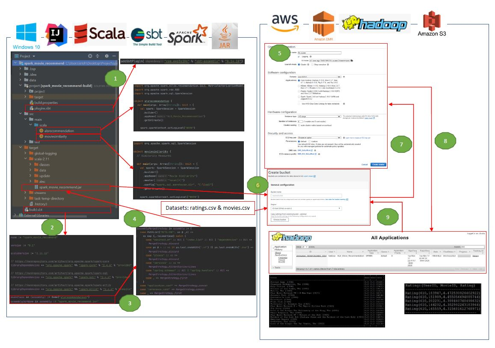

# Movie Recommendation System using Apache Spark deployed on EMR Cluster
This repo has the code base for Movie Recommendation System developed in Apache Spark with Scala. There are a couple of ways to develop recommendation engines that typically produce a list of recommendations.
* __Content based filtering approach__: Two similarity metrics are used in form of Cosine similarity based on Euclidean Distance metric and Jaccard similarity based on set theory These two metrics find the similarities between two movies based on the ratings received by similar users. (Folder: `local_deploy` ; Code: `moviesimilarity.scala`)
* __Model based collaborative filtering approach__: In this technique, users and products are described by a small set of factors, also called latent factors. The LFs are then used to predict the missing entries. The Alternating Least Squares algorithm is used to learn these LFs. This filtering approach is commonly used for real time movie recommendations. (Folder: `aws_deploy` ; Code: `alsrecommendation.scala`)

## About Data
The dataset is downloaded from [MovieLens](https://grouplens.org/datasets/movielens/). It contains 25,000,095 ratings from 162,541 users on 62,423 movies.

## System Requirements
* IntelliJ Project Setup Information:
	* JDK Version: 1.8.0_271-b09   
	* Scala Version: 2.11.12   
	* SBT Version: 1.14.0
* Check build.sbt to see Spark project dependencies.
* AWS EMR Cluster Setup Information:
	* Software Configuration: 
		* Release: emr-5.31.0 
		* Applications: Spark 2.4.6 on Hadoop 2.10.0 YARN and Zeppelin 0.8.2
	* Hardware Configuration: Instance Type: 4 General Purpose m5.xlarge (1 Master and 3 Core nodes)

## Deployment Workflow

## Note:
Code base is copied from [PacktPublishing/Scala-Machine-Learning-Projects](https://github.com/PacktPublishing/Scala-Machine-Learning-Projects/tree/master/Chapter06).